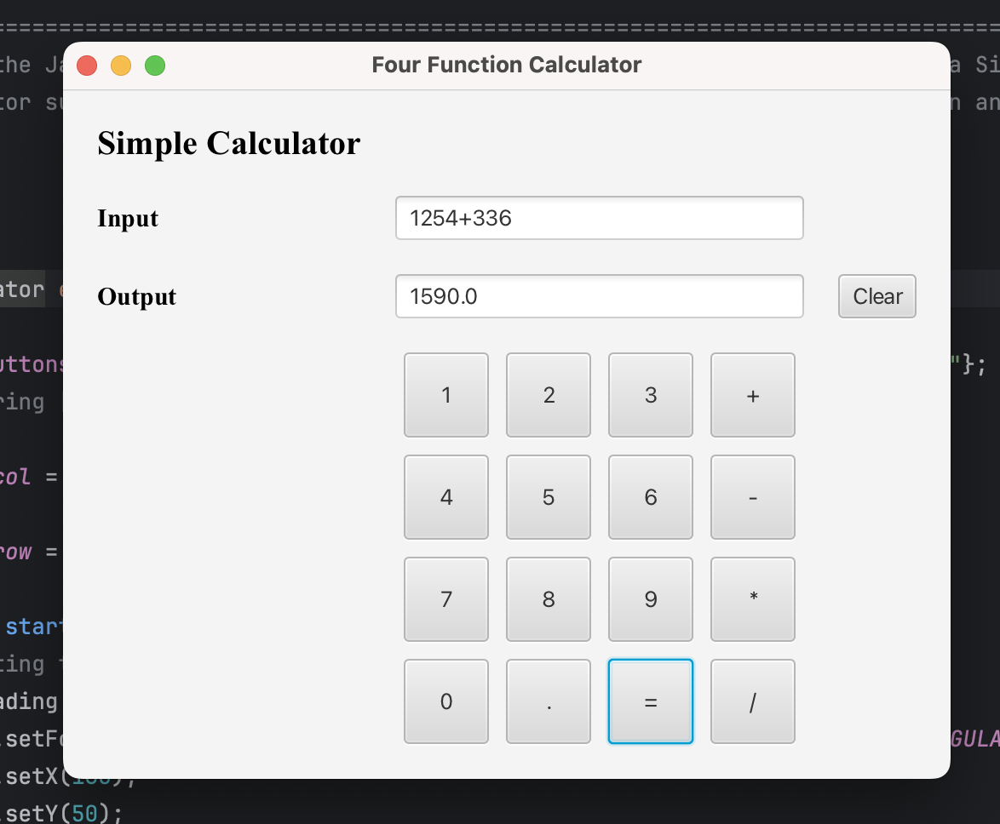
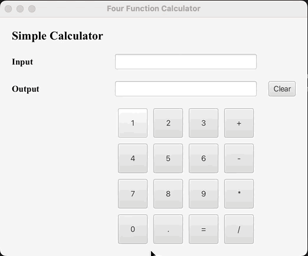

# JavaFX Simple Calculator

This is a simple four function calculator application built using JavaFX.
This application has basic UI to support plus, minus, multiply and divide operations.

## Installation and Configuration set up to run this JavaFx Caluculator Application

To run this project, you need to configure JavaFX in IntelliJ IDEA. Follow these steps:

1. **Launch IntelliJ IDEA and open your JavaFX project.**

2. **Navigate to Run/Debug Configurations:**
    - Click on the drop-down menu next to the green play button in the toolbar.
    - Select "Edit Configurations..." from the list. This will open the Run/Debug Configurations window.

3. **Add a New Configuration:**
    - In the Run/Debug Configurations window, click on the "+" icon at the top left corner to add a new configuration.
    - From the dropdown menu, select "Application".

4. **Configure the New Run/Debug Configuration:**
    - Give your new configuration a name, such as "JavaFX Application".
    - Set the main class of your JavaFX application by clicking on the browse (...) button next to the "Main class" field and selecting the appropriate class that contains your main method.
    - Set the working directory if necessary.

5. **Specify JavaFX VM Options:**
    - To specify JavaFX VM options, you typically need to add the following VM options:
      ```
      --module-path /path/to/javafx-sdk/lib --add-modules javafx.controls,javafx.fxml
      ```
      Replace `/path/to/javafx-sdk/lib` with the actual path to the lib directory of your JavaFX SDK installation.

6. **Apply and Save Configuration:**
    - Click "Apply" to apply the changes.
    - Click "OK" to close the Run/Debug Configurations window.

7. **Run or Debug Your JavaFX Application:**
    - Now, you can run or debug your JavaFX application using the newly created run/debug configuration.
    - Click on the green play button in the toolbar and select the configuration you just created from the dropdown list.

## Usage
Once the configuration is set up, you can simply run the application and use the calculator interface to perform the basic arithmetic operations.

## Dependencies
This project requires Java 8 and JavaFX for GUI.

## Application view


## Application Demo


## Credits
- Author: Anvitha Hiriadka
- Created on: 04/26/2024