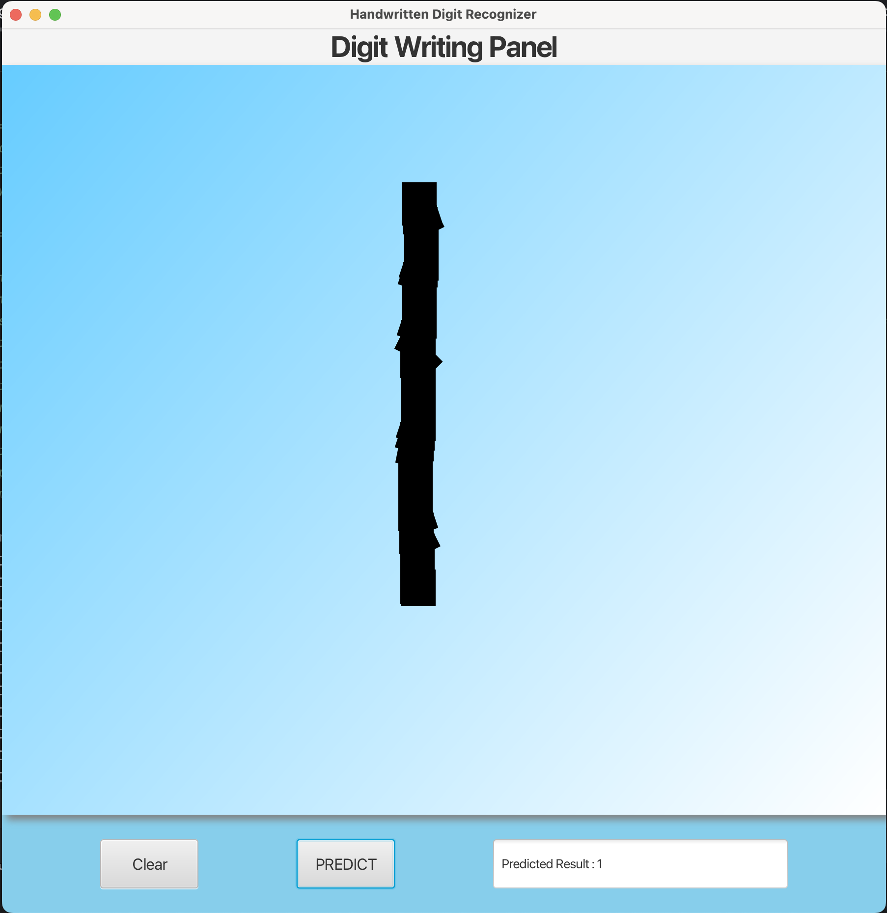
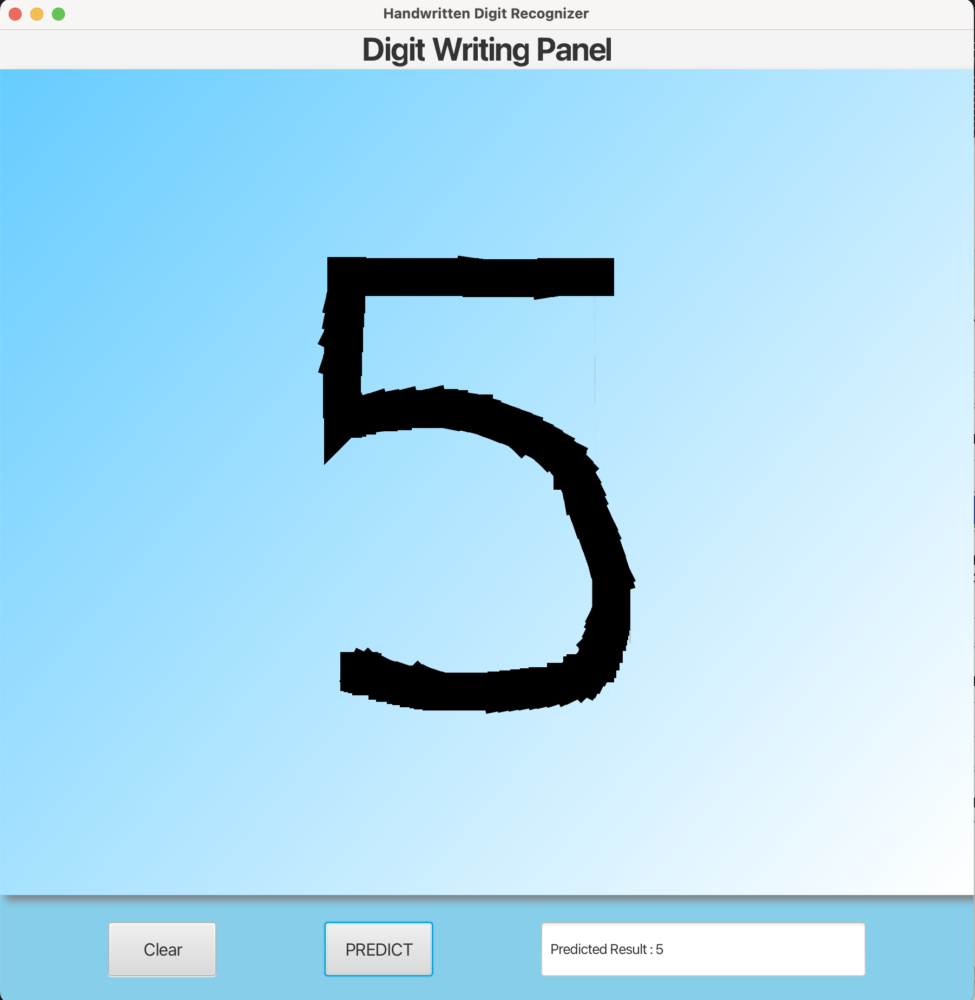

# Handwritten Number Recognizer
This project is a handwritten number recognizer implemented in Java using JavaFX for the GUI and TensorFlow based model for number recognition.<br>
The user can draw numbers (0-9) using a touch screen or mouse on the GUI, and the program will predict the drawn number using a pre-trained TensorFlow model.

## Setup
### Dependencies
- This project requires Java 8 and JavaFX for GUI. <br>
- For number recognition model - tensorflow, Python 3.11.5.

### Requirements
- Setup
- Requirements
- Java Development Kit (JDK)
- Python
- TensorFlow
- JavaFX
- Matplotlib, numpy (Optional - only to train the model)

### Installation
- Clone this repository.
- Install the required dependencies listed above.
- Make sure the TensorFlow model file (number_recognizer_model2.py) is in the correct directory.
- Set up the absolute path of the file "number_recognizer_model2.py" after cloning in line 138 of "Event_handler_canvas.java" file
- Make sure the trained model "handwritten_digit_model2.h5" is in the same working directory.
- Build and run the JavaFX application(GUI_Number_Recognizer.java).

### Files
- GUI_Number_Recognizer.java
  - Purpose: Entry point of the JavaFX application. 
  - Contents: Contains the main method to launch the application.
- Event_handler_canvas.java
  - Purpose: Handles the events on the Canvas
  - Contents: Contains various functions to handle the events happening the UI(Mouse pressed, Mouse Dragged, Button actions) and the Model trigger
- Canvas_EventHandler.java
  - Purpose: Interface for handling mouse on a canvas.
  - Contents: contains the methods for Mouse pressed and Mouse Dragged
- Image_processing.java
  - Purpose: Class for proceesing the image
  - Contents: contains the methods resizing the image and save the image as .png file
- number_recognizer_model2.py
  - Purpose: This file has the Tensor flow based model training, accuracy, loss tests and model is saved and loaded here for prediction using new images of number
  - Contents: contains Model training and digit recognition.
- handwritten_digit_model2.h5 : this is the trained model, which is loaded to predict new number images.

### Class Diagram (UML Diagram)

### Usage
- Launch the application.
- Draw a number on the canvas using the touch screen or mouse (anything between 0-9).
- Click the "PREDICT" button to predict the drawn number.
- <font color='red'>Please note that it take 5 seconds to predict the number, so a wait time for 5 seconds is added in the code.</font>
- After 5 Seconds, the pre-processed image is displayed, view it and close it. 
- Upon closing the predicted number displayed in the output field in GUI.
- The predicted number will be displayed on the output field of GUI.


### Image Processing
- The image processing is done using the ImageProcessing.java file. <br>
- This file pre-processes the drawn image by resizing it to 28x28 pixels and saving it in the correct format for TensorFlow prediction.
- After drawing the number on the canvas, click predict, before prediction , the image snapshot is taken and pre-processed to 28x28 pixels and converted to grayscale.
- Later this pre-processed image is passed to the Prediction Model.
- The Pre-processed Image looks as follows:

### Training (Optional)
If you wish to train the TensorFlow model with different data:

- Prepare your training dataset.
- Train the model using TensorFlow. Uncomment model training in number_recognizer_model2.py
- Save the trained model as number_recognizer_model2.py in the appropriate directory.

### Tests
#### Test 1: Mouse Input
- Description: Drawing numbers using a mouse.
- Steps: Run the application, draw numbers using the mouse, click "PREDICT"
- Expected Result: The drawn number is correctly recognized, predicted and displayed.


#### Test 2: Touch Screen Input
- Description: Drawing numbers using a touch screen(laptop).
- Steps: Run the application, draw numbers using touch screens, click "PREDICT"
- Expected Result: The drawn number is correctly recognized, predicted and displayed.


#### Test 3: Tested number recognition from digits 0-9
- Description: Drawing numbers using a touch screen(laptop)/Mouse.
- Steps: Run the application, draw numbers using touch screens, click "PREDICT"
- Expected Result: The drawn number is correctly recognized, predicted and displayed.







### Installation and Configuration set up to run this JavaFx Application

To run this project, you need to configure JavaFX in IntelliJ IDEA. Follow these steps:

1. **Launch IntelliJ IDEA and open your JavaFX project.**

2. **Navigate to Run/Debug Configurations:**
    - Click on the drop-down menu next to the green play button in the toolbar.
    - Select "Edit Configurations..." from the list. This will open the Run/Debug Configurations window.

3. **Add a New Configuration:**
    - In the Run/Debug Configurations window, click on the "+" icon at the top left corner to add a new configuration.
    - From the dropdown menu, select "Application".

4. **Configure the New Run/Debug Configuration:**
    - Give your new configuration a name, such as "JavaFX Application".
    - Set the main class of your JavaFX application by clicking on the browse (...) button next to the "Main class" field and selecting the appropriate class that contains your main method(GUI_Number_Recognizer.java).
    - Set the working directory if necessary.

5. **Specify JavaFX VM Options:**
    - To specify JavaFX VM options, you typically need to add the following VM options:
      ```
      --module-path /path/to/javafx-sdk/lib --add-modules javafx.controls,javafx.fxml
      ```
      Replace `/path/to/javafx-sdk/lib` with the actual path to the lib directory of your JavaFX SDK installation.

6. **Apply and Save Configuration:**
    - Click "Apply" to apply the changes.
    - Click "OK" to close the Run/Debug Configurations window.

7. **Run or Debug Your JavaFX Application:**
    - Now, you can run or debug your JavaFX application using the newly created run/debug configuration.
    - Click on the green play button in the toolbar and select the configuration you just created from the dropdown list.

**After the installation and configuration of the JavaFX, You can run the Application GUI_Number_Recognizer.java**

## Credits
- Author: Anvitha Hiriadka
- Created on: 04/26/2024